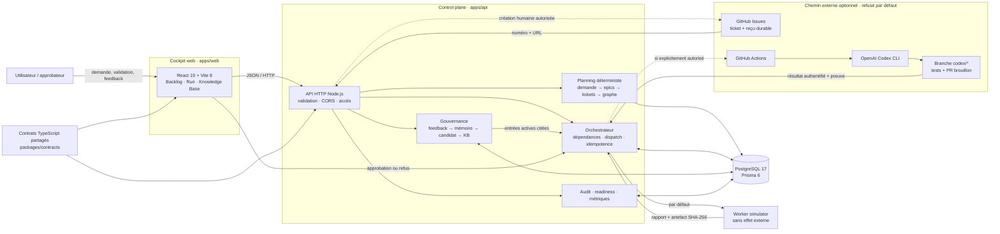

# Architecture du dépôt actuel

Ce document décrit l'état actuel du dépôt. L'architecture cible de l'usine unique,
indépendante des projets qu'elle opère, est documentée dans
[`docs/knowledge-base/TARGET_ARCHITECTURE.md`](./knowledge-base/TARGET_ARCHITECTURE.md).
Les exigences transverses sont détaillées dans la
[baseline cybersécurité et NIS2](./knowledge-base/SECURITY_NIS2.md) et
l'[architecture réseau/infrastructure](./knowledge-base/NETWORK_INFRASTRUCTURE.md).
Les parcours du cockpit et de l'onboarding sont définis dans la
[spécification de l'interface](./knowledge-base/INTERFACE_SPECIFICATIONS.md).

Le dépôt est un monorepo npm composé de trois unités :

- `apps/web` : cockpit React construit avec Vite, sans secret et sans appel direct privilégié aux connecteurs ;
- `apps/api` : gestionnaire HTTP Node.js, orchestration métier et connecteurs serveur ;
- `packages/contracts` : états et règles partagés, indépendants des frameworks.

## Vue d'ensemble du MVP

Le flux nominal est donc : une demande crée une session, le planificateur persiste
les epics et leurs tickets dépendants, puis chaque ticket prêt est dispatché
séparément. Un ticket terminé doit rendre une preuve adressée par SHA-256. Le
feedback reste temporaire dans la mémoire de session ; il ne devient connaissance
permanente qu'après proposition, décision indépendante et promotion explicite.

## Logiciels et bibliothèques utilisés

| Couche | Logiciel | Rôle dans le MVP |
| --- | --- | --- |
| Poste de développement | Windows, PowerShell, Codex Desktop, Git | édition, commandes, versionnement et développement assisté |
| Runtime | Node.js 22+, npm workspaces | exécution du monorepo et gestion des trois paquets |
| Frontend | React 19, React DOM, Vite 8, Lucide React | cockpit, build SPA et icônes |
| Backend | API native `node:http`, TypeScript 5, TSX | serveur HTTP local et logique métier sans framework serveur supplémentaire |
| Contrats | paquet TypeScript `@software-factory/contracts` | modèles, parseurs et machines d'états partagés entre web et API |
| Données | PostgreSQL 17 Alpine (image épinglée par digest), Prisma Client/CLI 6.12 | persistance, transactions, contraintes et migrations |
| Conteneurs | Docker Desktop, Docker Compose | PostgreSQL reproductible en local |
| Qualité | Vitest 4, ESLint 10, Prettier 3 | tests unitaires/E2E, contrôle statique et formatage |
| Automatisation locale | Concurrently | lancement simultané de l'API et du cockpit |
| CI/CD | GitHub, GitHub Actions, `gh`, `curl`, `jq` | CI, dispatch gouverné, branche dédiée et pull request brouillon |
| Développement agentique optionnel | OpenAI Codex CLI 0.147.0 | proposition de code bornée dans le runner GitHub, jamais fusionnée automatiquement |
| Hébergement préparé | Vercel | configurations séparées pour la SPA et la fonction API ; non requis pour le MVP local |

Confluence et l'adaptateur OpenAI serveur figurent dans le registre de readiness,
mais ne participent pas au chemin local livré. Ils restent désactivés tant qu'ils
ne sont pas explicitement autorisés et configurés. MainChain, OIDC/RBAC, SBOM et
signature de release appartiennent encore à la cible de production, pas au MVP
local validé.

## Invariants métier

La machine à états refuse les sauts arbitraires. Le planificateur produit des epics
et des tickets persistés avant tout run. Une `RunTask` référence son `Ticket` et ne
peut être dispatchée que si elle est prête et si toutes ses dépendances possèdent
un résultat terminé. Les clés d'idempotence portent les sessions, runs, commandes,
dispatchs et feedbacks. La publication GitHub Issues possède un reçu durable
`ExternalTicketSync`; un retry après état incertain recherche le marqueur du ticket
avant toute nouvelle création.

Un workflow Codex historique exige une spécification validée et les approbations
applicables. Le nouveau `TaskDispatch` produit un reçu et au moins un artefact
adressé par SHA-256 avant de terminer. La GitHub Action n'a pas la permission de
merger, ouvre toujours une pull request brouillon et renvoie son résultat au
cockpit. Le simulateur local suit le même contrat sans effet externe.

Un `FeedbackRecord` doit référencer un artefact du même projet, de la même session
et du même run. Il alimente d'abord un `SessionMemoryItem` à TTL et quota. Seul un
`KnowledgeCandidate` approuvé peut créer une `KnowledgeEntry`; portée, provenance,
version, supersession, révocation et citation restent persistées.

## Frontières de sécurité

Les jetons GitHub Actions, GitHub Issues, Confluence, cockpit et OpenAI ne sont utilisés que côté serveur
ou dans les secrets GitHub Actions. Les fournisseurs externes sont désactivés par
défaut et doivent être explicitement allowlistés. La cible GitHub est lue depuis le
projet persistant ; le navigateur ne peut pas choisir un autre dépôt. Le contexte
runner est authentifié par un jeton worker distinct, filtré, nettoyé et limité ; il
n'injecte que les entrées KB actives du projet ou communes, chacune avec une
citation.

En `NODE_ENV=production`, un `projectId` client ne suffit pas : les routes métier
exigent une session GitHub signée pour l'unique login allowlisté ou un
`COCKPIT_ACCESS_TOKEN` réservé aux appels serveur. Le flux OAuth conserve uniquement
le login, jamais le jeton GitHub ; le cookie `HttpOnly`/`Secure` expire après huit
heures et les mutations vérifient l'origine. Ce mode privé ne constitue pas
l'identité multi-utilisateur finale : OIDC/RBAC et identités de workload courtes
restent requis avant d'ajouter des utilisateurs.

L’audit conserve un hash du contenu et le hash d’intégrité précédent. Une étape ultérieure regroupera les événements en arbre de Merkle ; seule sa racine sera ancrée sur MainChain.

L'API expose une sonde de liveness, une readiness PostgreSQL/politique fournisseur
et des métriques RED en mémoire. Les clés métriques utilisent des routes normalisées
sans identifiant métier et gardent au plus 200 durées par route. En production,
l'accès aux métriques exige un jeton serveur distinct.

## Décisions à finaliser avant production

1. Fournisseur OIDC interne et politique RBAC.
2. Hébergement, rotation et chiffrement des secrets.
3. Remplacement du jeton runner par une identité de workload à durée de vie courte.
4. API exacte et environnement de MainChain.
5. Politique de rétention des données Confluence et GitHub.
6. `ComplianceContext` par service et personne morale, qualification NIS2,
   inventaire ReCyF et propriétaires de risque.
7. Zones réseau, egress des workers, RTO/RPO et restauration démontrée.
8. SBOM, provenance, signature et vérification des artefacts de release.
9. Pagination par curseur du détail des runs de 200 tâches et 10 000 événements.
10. Mécanisme de provisioning, compensation et matrice d'approbation de l'onboarding.
