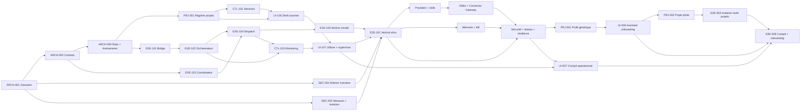

# Futures tâches

Backlog initial dérivé de l'[architecture cible](TARGET_ARCHITECTURE.md), du schéma
du 24 juillet 2026 et de la base JARVIS consolidée le 27 juillet 2026. Aucun élément
de cette liste n'est présenté comme déjà implémenté.

Les [spécifications fonctionnelles générales](SFG.md) définissent les exigences et
la traçabilité attendue. Une tâche déclare les identifiants SFG qu'elle couvre au
moment de son raffinement.

Toutes les tâches construisent une usine partagée et neutre. Les projets sont des
instances enregistrées du même `ProjectContext`, jamais des composants du control
plane ou de l'execution plane.

## Règles du backlog

- **P0** : nécessaire au premier flux de bout en bout.
- **P1** : nécessaire avant une exploitation réelle.
- **P2** : optimisation ou extension après mesure.
- Une tâche ne commence que lorsque son DoR est satisfait.
- Une tâche n'est terminée que lorsque son DoD et ses preuves sont consultables.

## Definition of Ready globale

- objectif, propriétaire produit et non-objectifs explicites;
- exigences SFG couvertes et comportement observable attendu;
- contrat d'entrée/sortie versionné;
- dépendances et porte humaine identifiées;
- risque, données sensibles et effets externes classés;
- modèle de menace, flux réseau et exigences ReCyF/ASVS applicables identifiés;
- critères d'acceptation et scénario de test définis;
- budget de temps, coût, performance, ressources, RTO ou RPO défini lorsque
  pertinent.

## Definition of Done globale

- contrat et migrations versionnés;
- cas nominal, refus et reprise testés;
- lint, tests et build passent;
- contrôles de secret, dépendances, code, IaC, image et permissions applicables
  passent;
- SBOM, provenance et digest produits pour un artefact livrable;
- métriques, logs et audit sans secret disponibles;
- dossier de preuve mis à jour et exception expirée ou approuvée;
- exigences SFG couvertes reliées à leurs tests et preuves;
- documentation et diagramme mis à jour;
- résultat démontré sur un scénario reproductible;
- approbation humaine enregistrée lorsqu'elle est requise.

## Graphe de livraison

## M0 — Figer le langage et les contrats

### ARCH-001 — Glossaire et ownership

- **Priorité / cible :** P0, partagé.
- **Livrable :** glossaire validé pour BM, EB, session, run, macro-tâche, tâche,
  instance, skill et feedback; ownership des modules internes de l'usine.
- **Preuve :** chaque composant de l'architecture possède un seul propriétaire et
  les termes ambigus ne figurent plus dans un contrat public.

### ARCH-002 — Contrats de domaine canoniques

- **Priorité / cible :** P0, `packages/contracts` ou paquet neutre partagé.
- **Dépend de :** ARCH-001.
- **Livrable :** schémas versionnés `ProjectContext`, `Session`, `MacroTask`,
  `TaskGraph`, `RoleProfile`, `ToolGrant`, `WorkerRun`, `Artifact`,
  `ApprovalDecision` et `Feedback`.
- **Preuve :** validation runtime, types générés ou partagés, fixtures valides et
  invalides; chaque contrat porte `projectId` et n'est dupliqué dans aucun plan.

### ARCH-003 — Machines à états et protocole événementiel

- **Priorité / cible :** P0, partagé.
- **Dépend de :** ARCH-002.
- **Livrable :** transitions Session/Task/Run, enveloppe d'événement, règles
  d'idempotence, corrélation, version et compatibilité.
- **Preuve :** tests exhaustifs des transitions et test de déduplication d'un
  événement rejoué.

### SEC-001 — Matrice de validation humaine

- **Priorité / cible :** P0, usine / control plane.
- **Dépend de :** ARCH-001.
- **Livrable :** niveaux de risque, actions bloquantes, rôles autorisés, double
  validation, expiration, refus et arbitrage.
- **Preuve :** aucun chemin d'exécution ne contourne une porte; l'auteur d'une
  demande ne peut pas l'auto-approuver.

### PRJ-001 — Registre et isolation des projets

- **Priorité / cible :** P0, usine partagée.
- **Dépend de :** ARCH-003.
- **Livrable :** registre `ProjectContext`, résolution des dépôts et politiques,
  namespaces mémoire/KB, budgets et autorisations de skills.
- **Preuve :** deux fixtures de projets arbitraires utilisent la même usine sans
  pouvoir lire, écrire ou exécuter dans le périmètre de l'autre.

## M1 — Première tranche verticale durable

### CTL-101 — Session Manager persistant

- **Priorité / cible :** P0, usine / control plane.
- **Dépend de :** PRJ-001.
- **Livrable :** création, lecture, reprise et annulation d'une session; contexte
  strictement partitionné par `projectId` et `sessionId`.
- **Preuve :** deux projets et deux sessions concurrentes ne partagent aucune donnée
  temporaire; reprise après redémarrage testée.

### CTL-102 — Interface de contrôle humain

- **Priorité / cible :** P0, usine / control plane.
- **Dépend de :** SEC-001, CTL-101.
- **Livrable :** file de validations, détail des preuves, approuver/refuser/demander
  modification et arbitrer.
- **Preuve :** l'exécution reste bloquée avant décision; chaque décision est
  horodatée, attribuée et auditée.

### EXE-101 — Bridge fiable

- **Priorité / cible :** P0, usine / execution plane.
- **Dépend de :** ARCH-003.
- **Livrable :** publication/consommation de `MacroTask` avec inbox/outbox,
  déduplication et accusé de prise en charge.
- **Preuve :** perte de connexion et livraison doublée n'entraînent qu'un seul run.

### EXE-102 — Orchestrateur durable minimal

- **Priorité / cible :** P0, usine / execution plane.
- **Dépend de :** EXE-101, SEC-001, PRJ-001.
- **Livrable :** état de run, transitions, pause/reprise/annulation, portes humaines
  et journal d'événements.
- **Preuve :** un processus arrêté au milieu d'un run reprend sans perdre ni doubler
  une transition.

### EXE-103 — Coordinateur et graphe de tâches

- **Priorité / cible :** P0, usine / execution plane.
- **Dépend de :** ARCH-002.
- **Livrable :** transformation d'une macro-tâche en DAG validé avec capacités,
  complexité, DoR, DoD, dépendances et budgets.
- **Preuve :** rejet des cycles et nœuds incomplets; fixture couvrant backend,
  frontend et design.

### EXE-104 — Ordonnanceur à capacité bornée

- **Priorité / cible :** P0, usine / execution plane.
- **Dépend de :** EXE-102, EXE-103.
- **Livrable :** file `ready`, réservation/lease, capacité configurable par type de
  worker, timeout et retry.
- **Preuve :** avec une capacité bornée par rôle/capacité, aucun type ne dépasse sa
  limite et les dépendances sont respectées.

### EXE-105 — Protocole worker et worker simulé

- **Priorité / cible :** P0, usine / execution plane.
- **Dépend de :** EXE-104.
- **Livrable :** contrat démarrer/heartbeat/artefact/terminer/annuler et worker
  déterministe sans fournisseur réel.
- **Preuve :** succès, échec, timeout, annulation et heartbeat perdu testés.

### CTL-103 — Dispatch et monitoring

- **Priorité / cible :** P0, usine / control plane.
- **Dépend de :** EXE-102, EXE-104.
- **Livrable :** vue sessions/runs/tâches, capacités, délais, tentatives, artefacts
  et événements corrélés.
- **Preuve :** l'état affiché est reconstruit depuis les événements et non simulé.

### UI-106 — Shell du cockpit et contexte autorisé

- **Priorité / cible :** P0, cockpit.
- **Dépend de :** PRJ-001, CTL-101.
- **Livrable :** navigation selon les droits, identité active, sélecteur de projet,
  routes canoniques et états chargement/vide/partiel/erreur/interdit/périmé.
- **Preuve :** clavier et lecteur d'écran sur le parcours critique; URL, filtre et
  `projectId` forgés sont refusés sans fuite de métadonnée.

### UI-107 — Nouvelle session et supervision d'un run

- **Priorité / cible :** P0, cockpit.
- **Dépend de :** UI-106, CTL-103, EXE-102.
- **Livrable :** saisie d'objectif, macro-tâche, liste de runs, détail graphe et
  chronologie, fraîcheur, flux reprenable et commandes idempotentes.
- **Preuve :** scénario PF-08 avec coupure/reconnexion, trou d'événement, double clic,
  état périmé et refus d'une commande non autorisée.

### E2E-101 — Tranche verticale avec worker simulé

- **Priorité / cible :** P0, partagé.
- **Dépend de :** CTL-101, CTL-102, EXE-101 à EXE-105, UI-107, SEC-002.
- **Livrable :** objectif conversationnel → macro-tâche → approbation → DAG →
  dispatch simulé → revue → feedback.
- **Preuve :** scénario automatisé reproductible, incluant refus humain et reprise
  après interruption.

## M2 — Modèles, rôles, skills et connecteurs

### EXE-201 — Contrat d'adaptateur de modèle

- **Priorité / cible :** P1, usine / execution plane.
- **Dépend de :** E2E-101.
- **Livrable :** interface commune génération/streaming/usage/erreur/annulation et
  politique de sélection sans fallback silencieux.
- **Preuve :** deux adaptateurs factices passent la même suite de conformité.

### EXE-202 — Premier adaptateur et worker Engineering

- **Priorité / cible :** P1, usine / execution plane.
- **Dépend de :** EXE-201.
- **Livrable :** premier adaptateur fournisseur retenu et worker Engineering
  capable d'exécuter un profil backend ou frontend; secrets côté serveur, timeout
  et budgets.
- **Preuve :** exécution contrôlée avec réponses enregistrées ou environnement de
  test, sans secret dans logs/artefacts.

### EXE-203 — Registre et loader de skills

- **Priorité / cible :** P1, usine / execution plane.
- **Dépend de :** E2E-101, SEC-002.
- **Livrable :** manifeste identifiant/version/hash/permissions, source approuvée,
  cache immuable et chargement ciblé.
- **Preuve :** skill altéré ou non approuvé refusé; deux versions peuvent être
  reproduites sans ambiguïté.

### EXE-204 — Skills Engineering et Design minimaux

- **Priorité / cible :** P1, usine / execution plane.
- **Dépend de :** EXE-203.
- **Livrable :** skills backend, frontend, review, test et design correspondant aux
  capacités du premier graphe.
- **Preuve :** chaque worker ne reçoit que les permissions et instructions de sa
  tâche.

### ROL-207 — Registre et profils de rôle

- **Priorité / cible :** P1, usine / execution plane.
- **Dépend de :** ARCH-002, EXE-203, SEC-001.
- **Livrable :** registre versionné Engineering, Platform/SRE,
  Security/Compliance, Product, Design, Support et Sales avec mission, types de
  tâche, skills, `ToolGrant`, interdictions, budgets, preuves et portes.
- **Preuve :** résolution du plus petit profil compatible; rôle, projet ou tâche ne
  peut augmenter les permissions; worker détruit à expiration.

### CON-208 — Connector Gateway

- **Priorité / cible :** P1, usine / execution plane.
- **Dépend de :** ROL-207, SEC-402.
- **Livrable :** contrat fournisseur-neutre pour lecture, brouillon, création,
  modification, envoi, suppression et administration; identité, pagination, rate
  limit, retry, idempotence, redaction et audit.
- **Preuve :** adaptateur factice et un adaptateur réel passent la même suite; un
  appel hors `ToolGrant`, inter-projet ou avec identité expirée est refusé.

### EXE-205 — Thinking mode

- **Priorité / cible :** P1, usine / execution plane.
- **Dépend de :** ARCH-002, EXE-201.
- **Livrable :** transformation conversation → `MacroTask`, avec validation,
  non-objectifs, risque, livrables et budgets.
- **Preuve :** entrées ambiguës demandent une clarification ou produisent un état
  bloqué; aucune exécution n'est lancée directement.

### EXE-206 — Adaptateurs fournisseurs supplémentaires

- **Priorité / cible :** P2, usine / execution plane.
- **Dépend de :** EXE-201 et besoin mesuré.
- **Livrable :** uniquement les adaptateurs justifiés parmi Kimi, Azure AI Foundry,
  OpenRouter et Z.ai/GLM.
- **Preuve :** suite de conformité, coût/latence/qualité mesurés et décision de
  routage documentée.

## M3 — Mémoire, feedback et Knowledge Base

### MEM-301 — Mémoire isolée par session

- **Priorité / cible :** P1, service partagé.
- **Dépend de :** CTL-101, ARCH-002.
- **Livrable :** stockage temporaire partitionné, TTL, quotas, récupération ciblée
  et suppression.
- **Preuve :** tests d'isolation inter-projet et inter-session, expiration et
  contrôle d'accès.

### MEM-302 — Feedback structuré

- **Priorité / cible :** P1, partagé.
- **Dépend de :** E2E-101, MEM-301.
- **Livrable :** événements feedback humain/agent/test, rattachement aux preuves et
  déduplication.
- **Preuve :** un feedback influence la session concernée sans modifier directement
  la KB permanente.

### KB-303 — Pipeline de promotion permanente

- **Priorité / cible :** P1, usine / service partagé.
- **Dépend de :** MEM-302, CTL-102.
- **Livrable :** proposition, validation, version, provenance, portée, révocation et
  audit d'une entrée projet ou commune.
- **Preuve :** aucune sortie brute n'est publiée automatiquement; une entrée peut
  être révoquée sans effacer son historique; une promotion inter-projets exige une
  décision explicite.

### KB-304 — Recherche et composition de contexte

- **Priorité / cible :** P1, service partagé.
- **Dépend de :** KB-303.
- **Livrable :** recherche filtrée par projet/droits, classement, citations,
  déduplication et budget de contexte.
- **Preuve :** chaque élément injecté est attribuable à une entrée et une version de
  la KB; aucune donnée d'un autre périmètre n'est révélée.

### SKL-305 — Cycle d'évolution de la bibliothèque de skills

- **Priorité / cible :** P1, usine partagée.
- **Dépend de :** EXE-203, MEM-302.
- **Livrable :** proposition depuis une lacune observée, tests de conformité, revue,
  version, publication, dépréciation et mesure d'efficacité d'un skill.
- **Preuve :** un projet peut proposer un skill sans l'imposer à l'autre; seule une
  version promue devient disponible dans le catalogue commun.

## M4 — Sécurité, réseau, résilience et sobriété

### SEC-002 — Modèle de menace et isolation d'exécution

- **Priorité / cible :** P0, partagé.
- **Dépend de :** ARCH-001.
- **Livrable :** menaces prompt injection, exfiltration, supply chain skill,
  escalade de permission, confusion inter-projet/session, contenu non fiable, SSRF,
  effets destructeurs, compromission fournisseur et abus de coût; contrôles et
  risques résiduels.
- **Preuve :** tests négatifs, limites de sandbox et permissions minimales pour
  bridge, loader, outils et workers.

### GOV-401 — Gouvernance NIS2 et matrice ReCyF

- **Priorité / cible :** P1, plateforme et chaque projet.
- **Dépend de :** PRJ-001, SEC-002.
- **Livrable :** propriétaire cyber, RACI, tolérance au risque, registre, revue de
  direction, `ComplianceContext` et matrice des 20 objectifs ReCyF par
  `legalEntityId`/`projectId`.
- **Preuve :** statut NIS2 attribué avec date et source; aucun statut inconnu ne
  peut être présenté comme conforme; chaque écart possède responsable et échéance.

### SEC-402 — Identités, secrets et Zero Trust

- **Priorité / cible :** P1, partagé.
- **Dépend de :** EXE-102, SEC-002, PRJ-001.
- **Livrable :** SSO/MFA humain, RBAC/ABAC, élévation JIT, identités de workload
  courtes, coffre de secrets, séparation projets/environnements et révocation.
- **Preuve :** accès croisés, identité expirée, secret non autorisé et
  auto-approbation sont refusés; revues d'accès et rotation disponibles.

### NET-403 — Zones réseau et infrastructure en code

- **Priorité / cible :** P1, partagé.
- **Dépend de :** SEC-402.
- **Livrable :** edge protégé, plans contrôle/exécution/données/administration
  segmentés, data plane privé, egress allowlisté, matrice de flux, TLS 1.3 par
  défaut, parité IPv4/IPv6 et configuration en code.
- **Preuve :** tests négatifs inter-zones/inter-projets, egress refusé, scan
  d'exposition, contrôle IaC et détection de dérive.

### SEC-404 — Secure SDLC et chaîne de livraison

- **Priorité / cible :** P1, partagé.
- **Dépend de :** SEC-002, ARCH-002.
- **Livrable :** contrôles SSDF/ASVS applicables, dépendances/actions/images
  épinglées, détection de secrets, SAST/SCA/IaC/image, SBOM, provenance, signature
  et vérification avant déploiement.
- **Preuve :** artefact non vérifié refusé; dossier release reliant commit, tests,
  SBOM, provenance, digest, approbation et configuration effective; évaluation SLSA
  1.2.

### VUL-405 — Vulnérabilités et divulgation coordonnée

- **Priorité / cible :** P1, partagé.
- **Dépend de :** SEC-404, GOV-401.
- **Livrable :** inventaire continu, surveillance code/dépendances/images/IaC/skills,
  priorisation par exploitation/exposition/impact, SLA, exceptions expirables et
  canal de signalement.
- **Preuve :** exercice sur une vulnérabilité KEV fictive, chronologie de
  confinement/correction et risque accepté si délai dépassé; aucun résultat
  critique ou élevé n'est ignoré sans triage, propriétaire et échéance.

### OPS-401 — Observabilité, détection et audit corrélé

- **Priorité / cible :** P1, partagé.
- **Dépend de :** EXE-102, SEC-402, NET-403.
- **Livrable :** événements authentification/autorisation/egress/secret/policy,
  métriques, traces corrélées, horloge fiable, détections et audit protégé sans
  secret.
- **Preuve :** un run est retraçable par `correlationId`; règles d'alerte testées,
  couverture et temps de détection/traitement mesurés.

### PERF-402 — Baseline de performance et coût

- **Priorité / cible :** P1, partagé.
- **Dépend de :** E2E-101.
- **Livrable :** latences p50/p95 par étape, débit, mémoire, taille de contexte,
  tokens/coût, CPU, stockage, réseau, limites de concurrence et backpressure.
- **Preuve :** benchmark reproductible et budgets inscrits dans
  [Performance](PERFORMANCE.md).

### REL-403 — Résilience et reprise

- **Priorité / cible :** P1, partagé.
- **Dépend de :** OPS-401, PERF-402, NET-403.
- **Livrable :** tests panne bridge, fournisseur indisponible, worker perdu,
  événement dupliqué, approbation expirée, saturation, certificat expiré,
  redémarrage orchestrateur; criticité, mode dégradé, RTO/RPO et sauvegardes
  isolées.
- **Preuve :** aucun effet externe doublé; chaque run finit dans un état explicable;
  restauration trimestrielle C0/C1 atteignant les RTO/RPO validés.

### IR-406 — Réponse à incident et notification NIS2

- **Priorité / cible :** P1, plateforme et chaque entité.
- **Dépend de :** GOV-401, OPS-401, REL-403.
- **Livrable :** qualification, confinement, conservation des preuves, cellule de
  crise, contacts hors bande, workflow 24 h/72 h/un mois conditionnel et modèles de
  communication.
- **Preuve :** exercice de table chronométré avec `T0`, alerte précoce, notification,
  rapport final, approbations et distinction des autres obligations applicables.

### ECO-407 — Sobriété et autoévaluation RGESN

- **Priorité / cible :** P1, partagé puis par projet/service.
- **Dépend de :** PERF-402, REL-403.
- **Livrable :** unité fonctionnelle, mesure calcul/mémoire/stockage/réseau/tokens,
  right-sizing, scale-to-zero, rétention, choix de modèle proportionné et
  autoévaluation des critères RGESN applicables.
- **Preuve :** comparaison reproductible sans régression de qualité, sécurité,
  SLO/RTO/RPO; déclaration d'écoconception uniquement si ses preuves existent.

### CMP-408 — Dossier de preuve et audit d'efficacité

- **Priorité / cible :** P1, partagé.
- **Dépend de :** GOV-401, SEC-404, VUL-405, IR-406, ECO-407.
- **Livrable :** registre versionné contrôle → périmètre → propriétaire →
  implémentation → test → artefact → exception → prochaine revue.
- **Preuve :** exports d'audit séparés pour deux projets arbitraires, tests d'efficacité et
  impossibilité de masquer un contrôle manquant par un document déclaratif.

## M5 — Onboarding générique des projets

### PRJ-501 — Contrat d'onboarding générique

- **Priorité / cible :** P1, plateforme.
- **Dépend de :** KB-304, CMP-408.
- **Livrable :** schéma et validation de `ProjectContext`, modèle de profil, statuts,
  dépôts, politiques, rôles, budgets, KB et catalogue de skills autorisés.
- **Preuve :** un profil valide est enregistré sans modifier le cœur; un profil
  incomplet ou sur-privilégié est refusé.

### PRJ-502 — Onboarding d'un projet pilote

- **Priorité / cible :** P1, premier projet autorisé.
- **Dépend de :** PRJ-501.
- **Livrable :** profil instancié depuis le contrat générique, avec responsables,
  conformité, dépôts, politiques, budgets et preuves.
- **Preuve :** un objectif du projet pilote traverse l'usine complète dans son
  namespace sans code spécifique au projet.

### UI-506 — Assistant d'onboarding

- **Priorité / cible :** P1, cockpit et control plane.
- **Dépend de :** UI-106, PRJ-501, CTL-102, SEC-402.
- **Livrable :** brouillon versionné, dix étapes du profil, validation sans effet,
  diff, plan, approbations et suivi du provisioning/reprise.
- **Preuve :** profil incomplet, conflit de version, sur-privilège, approbation
  obsolète et panne à chaque étape sont traités sans ressource orpheline silencieuse.

### UI-507 — Vue opérationnelle de l'usine

- **Priorité / cible :** P1, cockpit plateforme et projet.
- **Dépend de :** UI-107, OPS-401, PERF-402, REL-403.
- **Livrable :** vue d'ensemble, files, capacité, budgets, approbations, alertes,
  incidents, catalogues et exports selon le mandat.
- **Preuve :** profil `cockpit-v1`, Core Web Vitals, fraîcheur, données partielles et
  agrégats sans fuite inter-projets mesurés avec les contrôles actifs.

### E2E-503 — Coexistence multi-projets

- **Priorité / cible :** P1, usine partagée.
- **Dépend de :** PRJ-501, PRJ-502.
- **Livrable :** deux runs concurrents utilisant les mêmes services et agents
  disponibles, avec mémoires, secrets, artefacts et politiques distincts.
- **Preuve :** test automatisé d'absence de fuite inter-projets et partage contrôlé
  d'un skill commun versionné.

### E2E-504 — Application de gestion de parc informatique

- **Priorité / cible :** P1, partagé.
- **Dépend de :** EXE-202 à EXE-205, ROL-207, CON-208, PRJ-502.
- **Livrable :** génération contrôlée d'une application minimale de gestion de parc
  par profils Engineering et Design, avec validations et artefacts.
- **Preuve :** démonstration automatisée depuis le thread initial jusqu'aux tests,
  à la revue humaine, au rapport final et au feedback promu.

### E2E-505 — Workflow transversal JARVIS modernisé

- **Priorité / cible :** P1, usine partagée.
- **Dépend de :** E2E-504, OPS-401, REL-403.
- **Livrable :** demande Product → spécification → Engineering → contrôle
  Security/Compliance → préparation Platform/SRE → approbation → déploiement
  simulé → brouillon Support, tous coordonnés par le `TaskGraph`.
- **Preuve :** aucune communication directe entre workers; permissions distinctes,
  blocage sécurité déterministe, porte production, rollback simulé, artefacts et
  audit corrélés de bout en bout.

### E2E-508 — Cockpit et onboarding de bout en bout

- **Priorité / cible :** P1, usine partagée.
- **Dépend de :** UI-506, UI-507, PRJ-502, E2E-503.
- **Livrable :** opérateur → brouillon → validation → approbations → provisioning →
  activation → nouvelle session → run → supervision → commande → preuve.
- **Preuve :** parcours navigateur automatisé incluant refus, reprise après coupure,
  isolation croisée, accessibilité, budgets et export du dossier d'activation.

## Ordre de démarrage recommandé

1. ARCH-001 et SEC-002 peuvent commencer immédiatement.
2. ARCH-002 suit le glossaire, puis ARCH-003.
3. PRJ-001 pose l'isolation, puis CTL-101 et EXE-101 démarrent en parallèle.
4. EXE-102 et EXE-103 convergent dans EXE-104.
5. UI-106 et UI-107 rendent la tranche visible; le premier objectif de livraison est
   E2E-101, sans fournisseur réel ni loader distant.
6. SEC-402, NET-403 et SEC-404 précèdent tout fournisseur ou worker réel; GOV-401
   peut avancer dès que le registre projets existe.
7. ROL-207 et CON-208 activent d'abord Engineering; les autres rôles restent
   invocables en simulation jusqu'à l'existence d'un workflow et d'un propriétaire.
8. La télémétrie, la reprise, l'incident NIS2 et la sobriété sont prouvés avant
   l'onboarding réel.
9. Un projet réel est onboardé seulement après validation de l'usine avec les
   workers simulés; chaque projet supplémentaire réutilise le même contrat et garde
   un dossier de preuve séparé.
10. UI-506 et UI-507 convergent dans E2E-508 avant de déclarer le cockpit exploitable.
