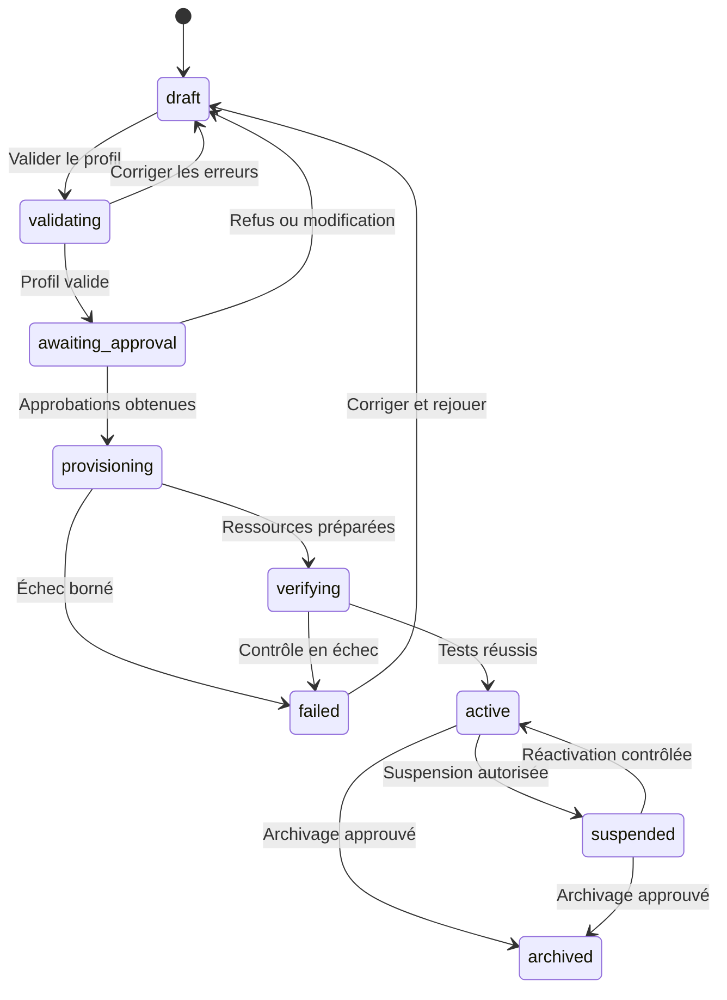

# Spécifications de l'interface de pilotage

| Métadonnée | Valeur                                            |
| ---------- | ------------------------------------------------- |
| Version    | 0.1                                               |
| Date       | 4 août 2026                                       |
| Statut     | Baseline fonctionnelle décidée pour le MVP        |
| Produit    | Cockpit de l'usine logicielle unique              |
| Portée     | Utilisation, supervision et onboarding de projets |

## 1. Objet

Le cockpit est l'interface humaine du control plane. Il permet à un utilisateur
autorisé de :

1. enregistrer et activer un nouveau projet sans modifier le cœur de l'usine;
2. formuler un objectif et suivre son exécution;
3. comprendre l'état, les coûts, les risques, les preuves et les blocages;
4. approuver, refuser, interrompre, reprendre ou relancer une action selon son mandat;
5. administrer les rôles, skills, connecteurs et politiques de son périmètre;
6. consulter et exporter les preuves nécessaires aux opérations et à la conformité.

Le cockpit n'est ni l'orchestrateur, ni la source canonique des runs. Il présente
des read models issus de l'état durable et émet des commandes validées vers le
control plane.

## 2. Invariants d'expérience et de sécurité

1. Toute vue privée possède un contexte de projet explicite ou une portée plateforme
   autorisée.
2. Le serveur calcule les projets et actions accessibles; un `projectId` fourni par
   le navigateur n'accorde aucun droit.
3. Une donnée absente, inconnue, périmée ou masquée n'est jamais présentée comme
   saine ou égale à zéro.
4. Toute action produit un accusé de réception, un état terminal ou une possibilité
   de retrouver son suivi après reconnexion.
5. Les actions sensibles affichent cible, portée, effets, risque et contrôles avant
   confirmation.
6. Aucun secret, prompt brut, jeton ou payload sensible n'est rendu au navigateur.
7. Les agrégats plateforme ne permettent pas de déduire l'activité d'un projet non
   autorisé.
8. Les décisions et commandes sont idempotentes, attribuables et auditables.
9. L'interface reste utilisable au clavier, avec lecteur d'écran, zoom à 200 % et
   contraste conforme à WCAG 2.2 niveau AA.
10. Le chemin nominal reste court; les détails de preuve et d'administration sont
    disponibles à la demande.

## 3. Acteurs et droits fonctionnels

| Capacité                           | Demandeur       | Product Owner | Approbateur   | Opérateur plateforme | Security/Compliance | Curateur KB/skills | Auditeur     |
| ---------------------------------- | --------------- | ------------- | ------------- | -------------------- | ------------------- | ------------------ | ------------ |
| Voir ses projets autorisés         | Oui             | Oui           | Oui           | Selon mandat         | Selon mandat        | Selon mandat       | Selon mandat |
| Créer une session et un objectif   | Oui             | Oui           | Non           | Non                  | Non                 | Non                | Non          |
| Voir un run et ses artefacts       | Selon projet    | Selon projet  | Selon demande | Plateforme           | Selon mandat        | Non                | Lecture      |
| Pause/annulation réversible        | Selon politique | Oui           | Selon mandat  | Oui                  | Demande de blocage  | Non                | Non          |
| Approuver un effet sensible        | Non             | Selon matrice | Oui           | Selon matrice        | Selon matrice       | Non                | Non          |
| Créer un brouillon de projet       | Non             | Oui           | Non           | Oui                  | Oui                 | Non                | Non          |
| Activer/suspendre un projet        | Non             | Demande       | Selon matrice | Selon matrice        | Selon matrice       | Non                | Non          |
| Gérer rôles, skills et connecteurs | Non             | Proposer      | Non           | Plateforme           | Politique           | Catalogue          | Lecture      |
| Exporter les preuves               | Son périmètre   | Projet        | Décisions     | Plateforme           | Mandat              | Catalogue          | Mandat       |

Les droits effectifs restent l'intersection de l'identité, du rôle humain, du
projet, de la ressource, de l'opération et de la politique de risque.

## 4. Architecture de l'information

```text
Cockpit
├── Vue d'ensemble
├── Projets
│   ├── Registre
│   ├── Nouveau projet
│   └── Projet
│       ├── Résumé
│       ├── Sessions et runs
│       ├── Ressources et connecteurs
│       ├── Rôles, skills et modèles
│       ├── Budgets et résilience
│       └── Sécurité, conformité et preuves
├── Travail
│   ├── Nouvelle session
│   ├── Sessions
│   ├── Runs
│   └── Approbations
├── Catalogue
│   ├── Rôles
│   ├── Skills
│   └── Connecteurs
├── Knowledge Base
└── Plateforme
    ├── Capacité et files
    ├── Santé et alertes
    ├── Incidents
    └── Audit
```

### Routes canoniques proposées

| Route                               | Vue                            | Portée                            |
| ----------------------------------- | ------------------------------ | --------------------------------- |
| `/`                                 | Vue d'ensemble autorisée       | Plateforme ou projets accessibles |
| `/projects`                         | Registre des projets           | Liste filtrée côté serveur        |
| `/projects/new`                     | Assistant d'onboarding         | Brouillon                         |
| `/projects/:projectId`              | Résumé du projet               | Projet                            |
| `/projects/:projectId/settings/*`   | Configuration versionnée       | Projet                            |
| `/projects/:projectId/sessions/new` | Nouvel objectif                | Projet                            |
| `/sessions/:sessionId`              | Conversation et plan           | Projet déduit côté serveur        |
| `/runs`                             | Liste filtrable des runs       | Portée autorisée                  |
| `/runs/:runId`                      | Supervision détaillée          | Projet déduit côté serveur        |
| `/approvals`                        | File des décisions humaines    | Mandat de l'utilisateur           |
| `/catalog/roles`                    | Catalogue de rôles             | Plateforme/projet                 |
| `/catalog/skills`                   | Bibliothèque de skills         | Plateforme/projet                 |
| `/connectors`                       | Connecteurs et diagnostics     | Plateforme/projet                 |
| `/knowledge`                        | Recherche et promotions KB     | Plateforme/projet                 |
| `/platform`                         | Santé, capacité et incidents   | Opérateur                         |
| `/audit`                            | Recherche et export de preuves | Auditeur/mandat                   |

Une URL inconnue, une ressource supprimée et une ressource interdite produisent des
états distincts. L'état `403` ne révèle ni nom, ni existence, ni métadonnée privée.

## 5. Structure commune des écrans

Le shell contient :

- navigation principale adaptée aux droits;
- sélecteur de projet affichant uniquement les projets accessibles;
- recherche bornée dans le périmètre courant;
- centre d'approbations et d'alertes avec compteurs non sensibles;
- état de connexion et fraîcheur des données;
- identité active, rôle courant et accès à l'audit de ses propres actions.

Chaque écran métier affiche : titre, portée, état, dernière mise à jour, filtres
actifs et actions possibles. Les actions impossibles sont soit absentes pour une
question de droit, soit désactivées avec une raison lorsqu'elles dépendent de l'état.

Toutes les listes utilisent pagination par curseur, tri stable et filtres encodés
dans l'URL. Les filtres par défaut ne chargent pas un historique illimité.

### Wireframes fonctionnels

```text
┌ Navigation ─────────┬ Usine / Projet ▼ ─ Recherche ─ Approbations ─ Identité ┐
│ Vue d'ensemble      ├──────────────────────────────────────────────────────────┤
│ Projets             │ Santé │ Runs actifs │ File │ Budget │ Alertes            │
│ Sessions et runs    ├──────────────────────────────────────────────────────────┤
│ Approbations        │ Runs nécessitant une action  │ Capacité et saturation    │
│ Catalogue           ├──────────────────────────────────────────────────────────┤
│ Knowledge Base      │ Activité récente              │ Incidents / approbations  │
│ Plateforme          │                                                          │
└─────────────────────┴──────────────────────────────────────────────────────────┘
```

```text
┌ Run / état / fraîcheur / projet / budget ─── Pause · Annuler · Arbitrer ┐
│ Graphe des tâches                    │ Action suivante / blocage          │
├──────────────────────────────────────┼────────────────────────────────────┤
│ Chronologie corrélée                 │ Coûts, capacité et preuves         │
│ événement · acteur · reçu · version  │ artefacts · tests · approbations   │
└──────────────────────────────────────┴────────────────────────────────────┘
```

```text
┌ Nouveau projet ─ Brouillon v3 ───────────────────────────────────────────┐
│ 1 Identité  2 Responsabilité  3 Ressources  4 Connecteurs  5 Capacités  │
│ 6 Contrôles  7 Budgets  8 Validation  9 Approbations  10 Activation     │
├──────────────────────────────────────────────────────────────────────────┤
│ Formulaire de l'étape               │ Résumé effectif / erreurs / diff   │
├─────────────────────────────────────┴────────────────────────────────────┤
│ Enregistrer le brouillon                         Valider l'étape suivante │
└──────────────────────────────────────────────────────────────────────────┘
```

Sous 768 px, la navigation devient un panneau, les colonnes secondaires passent
sous le contenu principal et les tableaux critiques conservent leurs libellés sous
forme de liste structurée. Aucun parcours ne dépend d'un survol.

## 6. Vue d'ensemble de l'usine

### Contenu minimal

- projets actifs, suspendus et en onboarding accessibles à l'utilisateur;
- sessions et runs par état;
- profondeur des files, capacité disponible et backpressure;
- demandes d'approbation à traiter;
- alertes et incidents ouverts par sévérité;
- consommation et budget : temps, coût, tokens, calcul et stockage;
- taux de réussite, retries et temps jusqu'au résultat utile;
- fraîcheur des données et état du flux temps réel.

Les cartes renvoient vers la liste filtrée qui explique leur valeur. Une métrique
agrégée affiche son unité, sa fenêtre temporelle et son heure de calcul. La vue
plateforme masque les répartitions susceptibles de révéler un projet non autorisé.

## 7. Utiliser l'usine

### Nouvelle session

1. Choisir un projet actif et autorisé.
2. Décrire l'objectif et le résultat attendu.
3. Ajouter contraintes, non-objectifs, pièces jointes et échéance facultative.
4. Afficher les limites héritées du projet : coûts, outils, données et actions
   interdites.
5. Enregistrer un brouillon ou demander l'analyse.
6. Présenter les clarifications bloquantes.
7. Afficher la `MacroTask`, ses critères d'acceptation, risques, budgets et portes.
8. Demander la validation humaine prévue avant création du run.

Une pièce jointe est non fiable : type réel, taille, contenu actif, malware et droits
sont contrôlés avant qu'elle puisse être utilisée. Un brouillon ne lance aucun
worker et n'effectue aucun appel externe.

### Session

La page session combine conversation, versions de la macro-tâche, décisions,
artefacts et runs associés. Elle distingue explicitement : proposition, commande
acceptée, action en cours, action prouvée et action non réalisée.

## 8. Superviser un run

### Liste des runs

Filtres minimum : projet, période, état, risque, rôle, initiateur et présence d'une
alerte. Chaque ligne expose sans donnée sensible : objectif abrégé, état, progression,
durée, coût, budget restant, prochaine action, dernière activité et responsable.

### Détail d'un run

1. **En-tête** : état réel, projet, risque, initiateur, version du plan, budget,
   horodatage et action suivante.
2. **Graphe** : tâches, dépendances, rôle attendu, tentative active, DoR et DoD.
3. **Chronologie** : événements corrélés, décisions, transitions et reçus externes.
4. **Capacité** : temps de file, worker, modèle, outil, humain et stockage.
5. **Coût** : tokens, appels, calcul, stockage et écart au budget.
6. **Artefacts** : digest, provenance, SBOM, contrôles et statut de revue.
7. **Preuves** : tests, approbations, refus, exceptions et journaux expurgés.
8. **Commandes** : pause, reprise, annulation, retry ou demande d'arbitrage selon
   l'état et les droits.

Un retry crée une nouvelle tentative liée à la précédente. Une annulation affiche
les effets déjà commis et ceux qui n'ont pas pu être compensés. Une commande est
envoyée avec une clé d'idempotence et son résultat reste retrouvable après fermeture
de la page.

### Temps réel et fraîcheur

- le MVP utilise un flux serveur unidirectionnel pour les mises à jour et des
  commandes HTTP séparées;
- chaque événement porte `eventId`, `stateVersion`, `occurredAt` et `correlationId`;
- le client ignore les doublons et recharge le read model en cas de trou de version;
- après coupure, il reprend depuis le dernier événement connu ou recharge l'état;
- l'interface affiche `live`, `retardé`, `déconnecté` ou `inconnu`;
- une donnée périmée ne permet aucune décision sensible sans revalidation serveur.

## 9. Onboarder un projet

### Cycle de vie



`archived` est terminal pour l'identifiant du projet. Un nouveau projet reçoit un
nouveau `projectId`; l'historique n'est jamais réécrit.

### Étapes de l'assistant

1. **Identité** : `projectId` proposé, nom, objectif, propriétaires et statut.
2. **Responsabilité** : `legalEntityId`, Product Owner, technique, risque et
   approbateurs.
3. **Ressources** : dépôts, environnements, régions, données et flux.
4. **Connecteurs** : opérations autorisées, quotas et références d'identité.
5. **Capacités** : rôles, skills, versions, modèles et fournisseurs autorisés.
6. **Contrôles** : classification, rétention, NIS2/ReCyF, portes humaines et
   séparation des responsabilités.
7. **Budgets** : coût, tokens, temps, concurrence, SLO, RTO, RPO et mode dégradé.
8. **Validation** : erreurs, avertissements, diff, plan de provisioning et tests.
9. **Approbations** : décisions requises selon le risque et la personne morale.
10. **Activation** : provisioning, tests de refus, scénario nominal et rapport final.

Le brouillon est persistant, versionné et reprenable. Chaque étape peut être sauvée
sans déclencher les suivantes. La validation produit un rapport déterministe; elle
ne modifie aucun système externe.

### Règles d'activation

Un projet ne devient `active` que si :

- tous les champs obligatoires du [profil projet](projects/PROJECT_TEMPLATE.md) sont
  renseignés;
- `projectId` et namespaces sont uniques et immuables;
- les propriétaires et mandats sont valides;
- la qualification juridique porte un statut explicite, y compris `pending_review`;
- les permissions sont une réduction de la politique plateforme;
- les références de secrets existent sans que leur valeur soit exposée;
- les connecteurs réussissent des tests de lecture et de refus selon leur portée;
- l'isolation croisée, l'egress, les quotas et les portes humaines sont testés;
- budgets, rétention, RTO, RPO et mode dégradé sont définis;
- le plan de provisioning et son diff sont approuvés;
- un scénario nominal borné produit des preuves consultables.

Le provisioning est compensable lorsque possible. En cas d'échec, le rapport liste
les ressources créées, compensées, restantes et l'action humaine nécessaire.

## 10. Projets, catalogue et politiques

La page projet présente la configuration effective, sa provenance et ses écarts par
rapport à la baseline plateforme. Toute modification crée une nouvelle version et
repasse par validation; elle ne modifie pas rétroactivement les runs existants.

Les catalogues de rôles, skills et connecteurs distinguent : disponible, autorisé
par le projet, requis par une tâche, déprécié, révoqué et incompatible. Une
publication ou promotion affiche version, digest, propriétaire, tests, permissions,
risques et projets potentiellement affectés.

## 11. Approbations et actions sensibles

Une demande d'approbation affiche au minimum :

- projet, objectif, acteur demandeur et bénéficiaire;
- version exacte de l'objet examiné;
- diff et ressources touchées;
- effets externes, réversibilité et blast radius;
- niveau de risque, contrôles, preuves et exceptions;
- coût/budget, expiration et conséquence d'un refus.

Les décisions possibles sont `approve`, `reject`, `request_changes` et `expire`.
Une justification est obligatoire pour les décisions sensibles. La même identité ne
peut demander et approuver lorsque la séparation des responsabilités l'interdit.

## 12. États d'interface obligatoires

Chaque vue asynchrone définit :

- chargement initial et mise à jour en arrière-plan;
- absence de donnée avec action utile;
- résultat partiel avec éléments manquants nommés;
- erreur récupérable avec retry idempotent;
- erreur terminale avec identifiant de corrélation;
- droit insuffisant sans fuite d'information;
- donnée périmée et déconnexion;
- opération longue avec progression et possibilité de quitter la page;
- succès confirmé par le serveur, jamais seulement optimiste pour un effet sensible.

Les couleurs ne sont jamais l'unique porteur d'information. Focus, libellés,
messages d'erreur et annonces dynamiques sont testés automatiquement et manuellement.

## 13. Contrats d'API minimaux

### Requêtes

| Opération                  | Résultat                                                  |
| -------------------------- | --------------------------------------------------------- |
| `GET /api/me`              | Identité, mandats et capacités d'interface                |
| `GET /api/projects`        | Projets déjà filtrés côté serveur, pagination par curseur |
| `GET /api/projects/:id`    | Profil effectif, version et état d'onboarding             |
| `GET /api/overview`        | Read model agrégé du périmètre autorisé                   |
| `GET /api/sessions`        | Sessions filtrées et paginées                             |
| `GET /api/runs`            | Runs filtrés et paginés                                   |
| `GET /api/runs/:id`        | Run, tâches, budgets, artefacts et actions permises       |
| `GET /api/runs/:id/events` | Chronologie paginée ou reprise du flux                    |
| `GET /api/approvals`       | Décisions relevant du mandat courant                      |
| `GET /api/catalog/*`       | Versions et compatibilités autorisées                     |
| `GET /api/audit`           | Événements expurgés du périmètre autorisé                 |

### Commandes

| Opération                                    | Effet                                                         |
| -------------------------------------------- | ------------------------------------------------------------- |
| `POST /api/projects`                         | Crée un brouillon sans provisioning                           |
| `PATCH /api/projects/:id`                    | Modifie une version de brouillon avec contrôle de concurrence |
| `POST /api/projects/:id/validate`            | Produit un rapport sans effet externe                         |
| `POST /api/projects/:id/activation-requests` | Fige la version et ouvre les approbations                     |
| `POST /api/projects/:id/activate`            | Lance le provisioning autorisé et idempotent                  |
| `POST /api/sessions`                         | Crée une session dans un projet actif                         |
| `POST /api/sessions/:id/analyze`             | Produit ou révise la macro-tâche                              |
| `POST /api/runs/:id/commands`                | Pause, reprise, annulation ou retry selon politique           |
| `POST /api/approvals/:id/decisions`          | Enregistre une décision humaine immuable                      |

Chaque commande exige `Idempotency-Key`, valide un schéma borné et renvoie un
`commandId`. Les mises à jour de brouillon utilisent une version ou un `ETag`; un
conflit renvoie le diff nécessaire à une résolution explicite.

Le format d'erreur commun contient `code`, `message` sûr, `correlationId`, champs
invalides éventuels et caractère récupérable. Il ne contient ni stack, ni secret, ni
détail d'une ressource interdite.

## 14. Budgets non fonctionnels

- respecter les Core Web Vitals et plafonds de [Performance](PERFORMANCE.md);
- charger à la demande le graphe, l'audit, les catalogues et l'administration;
- afficher un retour local en moins de 100 ms pour une interaction sans réseau;
- viser un p95 inférieur à 500 ms pour les read models courants, sur le volume de
  référence à fixer avant implémentation;
- refléter un événement accepté en moins de 5 s en fonctionnement nominal;
- signaler une perte du flux temps réel en moins de 15 s;
- borner pages, filtres, recherche, graphe visible et chronologie;
- virtualiser seulement après mesure d'un coût de rendu réel;
- conserver une interface utilisable en lecture lors d'une indisponibilité partielle,
  sans autoriser d'action sur un état périmé;
- mesurer latence, erreurs, poids transféré et consommation par parcours, sans donnée
  personnelle ni contenu sensible dans la télémétrie.

Ces seuils initiaux deviennent des SLO seulement après mesure sur un profil de charge
documenté. La sécurité reste active pendant tous les benchmarks.

## 15. Critères d'acceptation

```gherkin
Scénario: onboarder un projet sans modifier le cœur
  Étant donné un opérateur autorisé et un profil complet
  Quand les validations, approbations, provisioning et tests réussissent
  Alors le projet devient actif avec un projectId immuable
  Et aucun code ni service propre au projet n'a été créé
  Et le dossier de preuve d'activation est exportable

Scénario: refuser un profil sur-privilégié
  Étant donné un brouillon demandant une opération interdite par la plateforme
  Quand l'opérateur valide le profil
  Alors la validation échoue avant tout effet externe
  Et l'écart, la règle et la correction attendue sont affichés

Scénario: superviser une exécution après reconnexion
  Étant donné un run actif et une interruption du flux temps réel
  Quand le navigateur se reconnecte
  Alors les événements manquants sont repris ou le read model est rechargé
  Et aucun événement n'est doublé dans la chronologie
  Et l'état affiché correspond à la version serveur

Scénario: protéger une action sensible
  Étant donné un run dont l'annulation peut laisser un effet externe
  Quand un utilisateur demande l'annulation
  Alors l'interface présente les effets, la réversibilité et l'approbation requise
  Et aucun effet n'a lieu avant une décision valide

Scénario: empêcher une fuite inter-projets
  Étant donné un utilisateur autorisé uniquement sur le projet alpha
  Quand il modifie l'URL, un filtre ou un identifiant vers le projet bêta
  Alors le serveur refuse la requête sans révéler l'existence du projet bêta
  Et la tentative est auditée
```

## 16. Definition of Done de l'interface

Une vue ou un parcours n'est terminé que si :

- le scénario nominal et les états de la section 12 sont implémentés;
- droits, refus, isolation projet et idempotence sont testés;
- clavier, lecteur d'écran, contraste, focus et zoom sont vérifiés;
- poids du bundle, Core Web Vitals et requêtes critiques sont mesurés;
- logs, métriques et traces sont corrélés sans payload sensible;
- textes, formats de date/nombre et fuseau sont cohérents;
- audit, preuves et runbook de support sont disponibles;
- la documentation et les contrats partagés sont à jour.

## 17. Décisions fixées et éléments à confirmer

### Décisions fixées

- un seul cockpit et un seul control plane pour tous les projets;
- contexte projet explicite, filtrage et autorisation côté serveur;
- read models pour l'affichage, commandes séparées et idempotentes;
- flux serveur unidirectionnel pour le MVP, avec reprise et fallback par rechargement;
- onboarding persistant, versionné, validé puis approuvé avant provisioning;
- références de secrets uniquement, jamais de valeur dans le navigateur;
- configuration effective et diff visibles avant toute activation;
- accessibilité WCAG 2.2 AA et budgets de performance dès le MVP.

### À confirmer avant implémentation concernée

- fournisseur OIDC et mapping exact des groupes vers les mandats;
- design system, langue initiale et stratégie d'internationalisation;
- technologie du flux temps réel si le déploiement retenu ne supporte pas le flux
  serveur durable;
- seuils p95 définitifs après constitution du jeu de données représentatif;
- stockage des read models et durée de la chronologie chaude;
- liste initiale des connecteurs réellement activables;
- approbateurs requis par classe de risque et personne morale.
