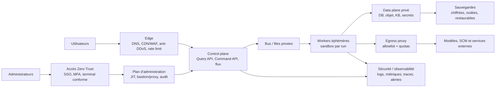

# Réseau et infrastructure : sécurité, robustesse, vitesse et sobriété

État : **architecture de référence proposée** pour l'usine partagée. Les choix de
produit ou de fournisseur restent ouverts jusqu'à une preuve de besoin.

## Ordre d'arbitrage

1. exigences légales, sécurité des personnes et invariants métier;
2. confidentialité, intégrité, disponibilité et capacité de reprise;
3. SLO utilisateur mesuré;
4. simplicité opérable et sobriété;
5. coût.

La duplication d'infrastructure n'est pas automatiquement robuste. Elle n'est
ajoutée que lorsqu'un scénario de panne, un RTO/RPO ou une mesure de capacité la
justifie. Inversement, la sobriété ne justifie jamais de supprimer une sauvegarde,
un contrôle ou une marge de sécurité nécessaire.

## Zones de confiance

Tous les projets enregistrés utilisent ces mêmes zones, mais leurs politiques,
identités, files, données, artefacts et secrets sont partitionnés. Un composant
partagé qui traite plusieurs projets reste un domaine de confiance de la plateforme; il
réautorise chaque requête avec le `projectId` issu de l'identité ou du contrat, pas
seulement d'un champ fourni par l'appelant.

## Règles réseau

- Refus par défaut entre zones, projets, workloads et environnements.
- Aucun worker, stockage, bus, port d'administration, SSH ou RDP directement exposé
  à Internet.
- Les entrées publiques passent par un edge protégé : validation de protocole,
  limite de taille, débit, concurrence, timeout et protection DDoS adaptée.
- Les sorties des agents passent par un proxy d'egress. Domaines, ports, méthodes,
  volume et durée sont autorisés par tâche; DNS direct et tunnel arbitraire sont
  refusés.
- Les services s'authentifient avec une identité de workload courte et utilisent
  mTLS lorsque le risque du flux le requiert. Une IP ou un sous-réseau n'est pas une
  identité.
- TLS 1.3 est le défaut de tout nouveau protocole. TLS 1.2 n'est toléré que pour une
  compatibilité documentée et surveillée; versions antérieures et suites faibles
  sont interdites.
- La parité de sécurité IPv4/IPv6 est testée. Activer IPv6 sans politiques,
  supervision et inventaire équivalents est interdit.
- DNS, certificats et horloges sont redondés selon la criticité et supervisés; le
  renouvellement de certificat est automatisé et testé avant expiration.
- Les flux réels et refusés sont observables. La matrice des flux est générée depuis
  la politique en code et comparée à la télémétrie pour détecter la dérive.
- Le navigateur ne contacte jamais directement worker, bus, base, coffre de secrets
  ou connecteur. Les diagnostics et le provisioning passent par le control plane,
  puis par des workloads bornés et le Connector Gateway.
- Les flux d'événements vers le cockpit ont authentification, heartbeat, durée,
  concurrence et buffer bornés. Une reconnexion reprend par curseur ou recharge un
  read model; elle ne déclenche aucune commande.

## Matrice de flux minimale

| Source         | Destination           | Autorisation                                                               |
| -------------- | --------------------- | -------------------------------------------------------------------------- |
| Internet       | Edge                  | HTTPS public explicitement publié; tout le reste refusé.                   |
| Edge           | Control plane         | Routes API publiées, identité edge, limites et timeout.                    |
| Control plane  | Navigateur            | Réponses filtrées et flux d'événements expurgé, sans secret ni commande.   |
| Control plane  | Registre projets      | Identité de service, version attendue, partition et audit.                 |
| Administrateur | Plan d'administration | SSO, MFA résistant au phishing, terminal conforme, accès JIT.              |
| Control plane  | Bus/files             | Identité de service, topics du projet, chiffrement, quotas.                |
| Worker         | Data plane            | Ressources et opérations du run uniquement, durée bornée.                  |
| Worker         | Service externe       | Proxy, destination et budget autorisés par la politique de tâche.          |
| Workload       | Secrets               | Secret nommé et versionné, identité autorisée, aucune énumération globale. |
| Plateforme     | Observabilité         | Émission structurée sans secret; lecture limitée aux rôles habilités.      |
| Projet source  | Tout autre projet     | Refus, y compris via recherche, cache, sauvegarde et observabilité.        |

Chaque nouveau flux décrit source, destination, identité, protocole, port, données,
motif, propriétaire, volume, timeout, rétention et condition de suppression.

## Infrastructure en code et durcissement

- Comptes, réseaux, routes, pare-feux, politiques, identités, secrets référencés,
  stockage, sauvegardes et alertes sont déclarés en code et revus.
- Les changements directs d'urgence sont journalisés puis réconciliés dans le code
  ou annulés. La dérive crée une alerte attribuée.
- Images et systèmes utilisent une baseline minimale, supportée et corrigée. Les
  services, ports, paquets et capacités noyau inutiles sont absents.
- Workloads non privilégiés, système de fichiers en lecture seule et répertoires
  temporaires bornés sont le défaut.
- Développement, test, préproduction et production utilisent des identités, secrets
  et données distincts. Les données de production ne sont pas copiées en test sans
  nécessité, minimisation et protection équivalente.
- Les changements de réseau, IAM, stockage ou chiffrement possèdent un plan de
  retour arrière et des tests négatifs.
- Une technologie d'orchestration, un service mesh ou une région supplémentaire
  n'est introduit que si le besoin mesuré dépasse ce qu'une solution plus simple
  peut garantir.

## Résilience

Chaque service reçoit un niveau de criticité. Les valeurs ci-dessous sont des
cibles initiales à valider par l'analyse d'impact métier.

| Niveau | Exemples                                          | RTO cible |    RPO cible | Stratégie minimale                                                             |
| ------ | ------------------------------------------------- | --------: | -----------: | ------------------------------------------------------------------------------ |
| C0     | Identité, approbations, audit de sécurité         |       1 h |        5 min | Redondance sans point unique critique, sauvegarde isolée, restauration testée. |
| C1     | Orchestrateur, bus, registre projets, KB          |       4 h |       15 min | Reprise automatisée ou documentée, journal rejouable, mode dégradé.            |
| C2     | Workers, calcul batch, environnements temporaires |      24 h | Rejeu du run | Éphémère, reconstructible depuis code et artefacts.                            |
| C3     | Démonstration et développement non actifs         |      72 h |         24 h | Extinction autorisée, reconstruction automatisée.                              |

Règles permanentes :

- inbox/outbox, idempotence et déduplication pour les messages et effets externes;
- timeouts explicites, annulation propagée, retry borné avec jitter et budget
  global; aucune boucle de retry infinie;
- backpressure et admission control avant saturation; concurrence réglée sur la
  capacité observée;
- circuit breaker et mode dégradé pour un fournisseur externe indisponible;
- aucune bascule silencieuse vers un modèle, une région ou un fournisseur dont les
  données, permissions, coût ou qualité diffèrent;
- sauvegardes chiffrées, versionnées, isolées ou hors ligne selon le risque,
  protégées contre la suppression par l'identité de production;
- restauration testée au moins trimestriellement pour C0/C1 et après changement
  significatif; exercice de crise complet au moins annuel;
- chaos ou injection de panne progressive en environnement sûr : perte réseau,
  latence, saturation, expiration de certificat, région indisponible, restauration
  et compromission d'identité.

Une sauvegarde non restaurée lors d'un test n'est pas considérée comme une preuve de
reprise.

## Performance

La vitesse est optimisée de bout en bout, sans contourner les contrôles :

- budget de latence distribué entre edge, authentification, application, file,
  fournisseur et stockage;
- p50, p95, p99, erreurs, saturation et débit mesurés séparément;
- connexions réutilisées et pools bornés; placement proche du stockage sur les
  chemins critiques;
- protocoles bavards, sérialisations, copies et appels en cascade supprimés avant
  d'ajouter du calcul;
- payloads, pages, contexte de modèle et résultats bornés; streaming seulement s'il
  améliore une expérience mesurée;
- caches seulement pour des données dont clé, durée, isolation, invalidation et
  sensibilité sont définies;
- autoscaling piloté par saturation, latence ou profondeur de file, avec minimum,
  maximum, délai de refroidissement et test de montée en charge;
- contrôles de sécurité inclus dans les benchmarks. Toute régression significative
  conduit à optimiser l'implémentation, pas à supprimer le contrôle.

Le budget de performance détaillé vit dans [Performance](PERFORMANCE.md).

## Sobriété

La baseline suit l'esprit du RGESN 2024 : durée de vie, ressources minimales,
sollicitation limitée des infrastructures et transparence.

- Mesurer par unité fonctionnelle : par exemple « une macro-tâche acceptée et
  vérifiée », avec calcul, mémoire, stockage, octets réseau, tokens, durée et coût.
- Choisir le plus petit modèle et le plus petit contexte qui atteignent le niveau de
  qualité et de sécurité exigé; un routage vers un modèle plus lourd requiert une
  raison observable.
- Éteindre ou mettre à zéro les workers et environnements non utilisés; planifier
  les travaux non urgents et éviter l'activité de polling.
- Mutualiser les composants stateless lorsque l'isolation logique est prouvée;
  isoler physiquement seulement lorsque le risque le justifie.
- Dimensionner depuis les percentiles, la croissance et la marge de reprise;
  supprimer la capacité durablement inutilisée.
- Dédupliquer artefacts et dépendances, compresser les transferts utiles, appliquer
  des politiques de cycle de vie et ne pas conserver « au cas où ».
- Journaliser ce qui permet sécurité, exploitation et preuve; échantillonner le
  diagnostic à fort volume sans réduire l'audit obligatoire.
- Préférer cache, batch, incrémental et réutilisation d'un résultat déterministe à
  un nouvel appel de modèle, si fraîcheur et confidentialité restent correctes.
- Tenir un inventaire des services tiers et de leurs impacts; la sobriété ne peut
  pas être déplacée hors du périmètre par sous-traitance.
- Produire une autoévaluation RGESN par projet/service et publier une déclaration
  seulement lorsque ses critères et preuves ont réellement été vérifiés.

## Observabilité utile

Chaque signal doit répondre à une question opérationnelle ou de sécurité. Le socle :

- métriques RED pour requêtes et files, USE pour ressources contraintes;
- traces corrélées par `projectId`, `sessionId`, `runId` et `correlationId`, sans
  contenu sensible;
- événements d'authentification, autorisation, élévation, secret, policy deny,
  egress, changement de configuration et déploiement;
- SLI de disponibilité, latence, fraîcheur, exactitude et capacité de reprise;
- alertes actionnables avec propriétaire, sévérité, runbook et déduplication.

Les logs à fort volume ont une rétention courte; les preuves de sécurité suivent la
durée justifiée par le risque et les obligations. Toute rétention est explicite.

## Tests d'acceptation de la plateforme

Avant une exploitation réelle :

1. un test démontre qu'un worker d'un projet ne peut atteindre aucune ressource
   privée d'un autre projet, dans les deux sens;
2. un egress non autorisé et un accès direct à Internet sont refusés et alertés;
3. une identité expirée ou révoquée ne peut plus appeler, lire ni déployer;
4. un secret injecté volontairement n'apparaît ni dans logs, traces, prompts,
   artefacts ni KB;
5. une panne de fournisseur respecte le budget de retry et laisse le run dans un
   état explicable;
6. une restauration C0/C1 atteint le RTO/RPO mesuré;
7. une charge supérieure à la capacité déclenche backpressure, pas une panne en
   cascade;
8. un artefact sans provenance, digest ou signature valide est refusé;
9. les contrôles réseau sont identiques sur IPv4 et IPv6;
10. le rapport compare performance, coût et ressources avant/après avec les
    contrôles de sécurité actifs.
11. une URL ou un filtre forgé ne permet ni accès ni déduction sur un autre projet;
12. une coupure du flux cockpit est signalée, reprise sans doublon et n'autorise
    aucune action sensible sur un état périmé;
13. le provisioning d'un projet ne peut joindre que les destinations et opérations
    déclarées dans sa version approuvée.
