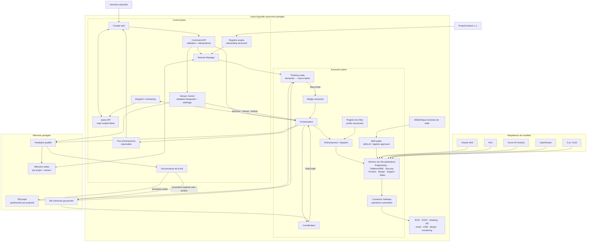

# Architecture cible de l'usine logicielle partagée

Sources : schéma d'architecture fourni le 24 juillet 2026 et base
`JARVIS_Architecture.docx` consolidée le 27 juillet 2026.

Statuts utilisés :

- **Décidé** : visible explicitement dans le schéma cible.
- **Proposé** : traduction technique nécessaire pour rendre le schéma exécutable.
- **À confirmer** : libellé ou responsabilité non déterminé par le schéma.

Les [SFG](SFG.md) définissent le comportement fonctionnel attendu. Ce document
décrit sa réalisation logique; en cas d'écart, la décision produit met à jour les
deux documents dans le même changement.

## Finalité produit

Le premier cas d'usage représenté est la création, par conversation, d'une
application de gestion de parcs informatiques. L'architecture doit cependant rester
générique : une demande devient une macro-tâche, puis un graphe de travaux exécutés
par des agents spécialisés sous contrôle humain.

L'usine opère **tout projet enregistré**, sans être elle-même un projet. Aucun projet
ne possède son propre orchestrateur : le control plane, l'execution plane, les
agents et la bibliothèque de skills appartiennent à la plateforme partagée.

Le [catalogue de rôles](AGENT_ROLES.md) réconcilie la première architecture JARVIS
avec cette cible : Engineering, Platform/SRE, Security/Compliance, Product, Design,
Support et Sales sont des profils invocables, pas sept services toujours actifs.
Le [cockpit](INTERFACE_SPECIFICATIONS.md) constitue l'interface humaine unique du
control plane pour utiliser, superviser et onboarder les projets.

## Modèle multi-projets

L'usine possède deux niveaux :

- **Plateforme partagée** : sessions, contrôle humain, orchestration, coordination,
  workers, monitoring, fournisseurs et bibliothèque évolutive de skills.
- **Contextes projet `1..n`** : instances du même contrat `ProjectContext`, avec
  dépôts, objectifs, politiques, mémoire, connaissances, artefacts et historique
  propres à chaque projet enregistré.

Chaque commande, événement, run, tâche, artefact, décision et entrée de mémoire porte
un `projectId`. Le partage entre projets est interdit par défaut. Seuls les skills
génériques et les connaissances explicitement promues dans un espace commun peuvent
être réutilisés.

L'usine applique une seule
[baseline cybersécurité et NIS2](SECURITY_NIS2.md) et une seule
[architecture réseau/infrastructure](NETWORK_INFRASTRUCTURE.md). Les contrôles sont
mutualisés; leur portée, leurs preuves, incidents, données et risques sont
néanmoins partitionnés par projet et personne morale.

## Socle transverse de confiance

Le control plane et l'execution plane dépendent d'un socle commun, sans lequel
aucune exploitation réelle n'est autorisée :

- identité humaine et de workload, politique, approbations et secrets;
- inventaire des actifs, flux, dépendances, données et propriétaires;
- réseau segmenté avec entrée protégée, data plane privé et egress contrôlé;
- chaîne de livraison sécurisée avec SBOM, provenance, signature et vérification;
- observabilité, détection, réponse à incident et dossier de preuve;
- sauvegarde, restauration, mode dégradé et exercice de crise;
- budgets de performance, capacité, coût, tokens et ressources.

Ces capacités sont des services de plateforme neutres. Les agents et skills les
consomment mais ne peuvent ni les reconfigurer, ni augmenter leurs permissions, ni
approuver leurs propres exceptions.

## Vue logique

Les fournisseurs ne sont pas des dépendances directes du domaine : ils sont
accessibles par des adaptateurs et une politique de sélection. Le schéma énumère
Kimi, Azure AI Foundry, OpenRouter, Claude SDK et Z.ai/GLM; leur activation exacte
reste configurable et commune aux projets.

## Flux nominal

1. L'utilisateur sélectionne un projet enregistré sur lequel il est autorisé, ouvre
   un thread et formule un objectif.
2. Le Session Manager crée une session isolée par projet et par thread, conserve son
   contexte et émet un événement de création.
3. Le thinking mode transforme la demande en `MacroTask` structurée.
4. Le bridge transmet la macro-tâche à l'orchestrateur avec un contrat versionné,
   idempotent et traçable.
5. Le coordinateur produit un `TaskGraph`, évalue capacités, complexité,
   dépendances, critères de préparation et critères de fin.
6. L'orchestrateur valide le graphe et l'ordonnanceur ne distribue que les nœuds
   prêts, dans la limite de capacité.
7. Le registre résout le plus petit profil de rôle compatible avec la tâche et le
   projet.
8. Le skill loader fournit au worker éphémère uniquement les skills approuvés
   requis; ses appels externes passent par le Connector Gateway.
9. Les workers Engineering, Platform/SRE, Security/Compliance, Product, Design,
   Support ou Sales produisent des résultats vérifiables selon le graphe.
10. Dispatch/monitoring remonte états, délais, erreurs, artefacts et demandes
    d'arbitrage.
11. Human Control bloque les décisions soumises à validation et arbitre les conflits.
12. Le feedback qualifié alimente la mémoire de session; seule une promotion
    contrôlée et traçable peut enrichir la Knowledge Base permanente.

## Composants et responsabilités

### Cockpit, Query API et Command API

**Décidé :** une seule interface humaine sert tous les projets et ne possède aucun
état métier canonique.

**Proposé :**

- le navigateur ne reçoit que des read models déjà filtrés par l'autorisation
  serveur;
- la Query API borne recherche, pagination, graphe, chronologie et agrégats;
- la Command API revalide identité, projet, ressource, opération, version et état;
- toute commande possède une clé d'idempotence et retourne un `commandId` durable;
- les brouillons utilisent une version ou un `ETag` pour refuser les écrasements;
- le flux d'événements est unidirectionnel, reprenable et séparé des commandes;
- une perte de flux rend l'état périmé visible et entraîne reprise ou rechargement;
- les secrets et données brutes sensibles restent côté serveur;
- l'interface applique les parcours et états définis dans
  [Interface de pilotage](INTERFACE_SPECIFICATIONS.md).

### Registre projets et onboarding

**Décidé :** un projet est une configuration versionnée du même `ProjectContext`,
jamais un fork du control plane.

**Proposé :** le registre possède brouillon, rapport de validation, version figée,
approbations, plan de provisioning, contrôles d'activation et état terminal. La
validation est sans effet externe; le provisioning est idempotent et compensable.
Seuls des tests réussis peuvent produire `active`.

### Session Manager

**Décidé :** crée plusieurs sessions (`Session`, `Session + 1`) et garde leur
contexte.

**Proposé :**

- garantit l'isolation stricte entre sessions;
- garantit l'isolation stricte entre projets;
- possède le cycle de vie de la conversation, pas celui des agents;
- propage `projectId`, `sessionId`, `correlationId` et identité humaine à tous les
  événements;
- permet reprise, annulation et lecture de l'historique.

### Human Control

**Décidé :** validation bloquante et arbitrage.

**Proposé :**

- aucune validation ne peut être accordée par l'agent qui demande l'autorisation;
- l'état reste `awaiting_approval` jusqu'à une décision explicite et auditée;
- refus, expiration et demande de modification sont des sorties normales;
- les règles de risque déterminent les portes humaines, sans les coder dans le
  frontend.

### Thinking mode

**Décidé :** transforme l'objectif en intention structurée avant exécution.

**Proposé :** produit une `MacroTask` sans lancer d'agent ni modifier un système
externe. Les catégories manuscrites « DEV, todolist, analyse, logic, techno, EB »
constituent une taxonomie à préciser; `EB` reste **à confirmer**.

### Bridge

**Décidé :** frontière entre entrée/planning et orchestration.

**Proposé :** contrat asynchrone versionné avec inbox/outbox, déduplication et
accusé de prise en charge. Il ne contient aucune logique de fournisseur de modèle.

### Orchestrateur

**Décidé :** reçoit les macro-tâches, crée et supervise les instances nécessaires.

**Proposé :**

- possède l'état durable d'un run;
- applique les transitions, portes humaines, budgets et politique d'échec;
- délègue la décomposition au coordinateur et l'exécution à l'ordonnanceur;
- ne génère pas lui-même du code et ne télécharge pas directement de skill.

### Coordinateur

**Décidé :** reçoit le travail macro et coordonne les agents.

**Proposé :**

- produit un graphe acyclique de tâches;
- renseigne capacité requise, complexité, dépendances, DoR, DoD et échéance;
- ne déclare un nœud `ready` que si son DoR et ses dépendances sont satisfaits;
- ne déclare jamais un résultat `completed` sans preuve du DoD.

La note « 1 back / 1 front / 1 designer » devient une capacité initiale
configurable, et non une constante du domaine. La note « nodes ? 3 » est interprétée
comme un exemple de décomposition, pas comme une limite.

### Dispatch / monitoring

**Décidé :** distribue et surveille le travail.

**Proposé :** l'ordonnanceur réserve une capacité avant dispatch, émet des heartbeats,
détecte les leases expirés et permet retry ou reprise sans doubler les effets.

### Skill loader

**Décidé :** récupère des skills, notamment depuis `skills.sh`, et les fournit aux
agents spécialisés.

**Proposé :**

- résout un manifeste épinglé par identifiant et version;
- vérifie origine, intégrité, compatibilité et permissions;
- met en cache de façon immuable;
- refuse l'installation implicite d'un skill non approuvé;
- expose des skills ciblés, par exemple Python au backend et HTML au frontend.

La bibliothèque est unique pour l'usine. Un projet peut autoriser, interdire ou
épingler une version sans forker silencieusement le catalogue commun. Un skill issu
d'un projet ne devient commun qu'après revue, tests de conformité et promotion.

### Registre de rôles

**Décidé depuis JARVIS :** l'usine expose plusieurs responsabilités spécialisées
avec des skills et permissions propres.

**Proposé :**

- un `RoleProfile` versionné décrit mission, types de tâche, skills, opérations,
  interdictions, budgets, preuves et portes;
- le profil effectif est l'intersection du rôle, du projet, de la tâche et de la
  politique de risque;
- un rôle est instancié uniquement lorsqu'un nœud prêt le demande, puis détruit;
- Engineering peut être décomposé en backend, frontend, design, review ou test sans
  transformer chaque capacité en service permanent;
- le catalogue complet et sa matrice vivent dans
  [Équipe d'agents](AGENT_ROLES.md).

### Connector Gateway

**Décidé depuis JARVIS :** les connecteurs sont des modules transversaux, pas des
agents.

**Proposé :** le gateway encapsule identité, validation, rate limit, retry,
idempotence, pagination, redaction et audit. Il expose des opérations stables
(`read`, `draft`, `create`, `update`, `send`, `delete`, `admin`) dont les
permissions restent distinctes. GitHub, Jira/Atlassian, Linear, Notion, Outlook,
Intercom, HubSpot, Figma, CI/CD, monitoring ou Google Sheets sont des adaptateurs
optionnels sélectionnés par projet.

Un tableur ou service externe peut recevoir un export de reporting; il ne remplace
jamais l'event store ni l'audit canonique.

### Agents et modèles

**Décidé :** rôles spécialisés Engineering, Platform/SRE, Security/Compliance,
Product, Design, Support et Sales; plusieurs fournisseurs sont envisagés.

**Proposé :** le protocole worker reste indépendant du rôle et du fournisseur. Un
adaptateur traduit requête, streaming, usage, erreurs et annulation vers un contrat
commun. Les rôles ne s'appellent pas directement : ils publient événements et
artefacts, puis l'orchestrateur suit le `TaskGraph`.

### Mémoire et feedback

**Décidé :** une KB permanente, une mémoire isolée par session et une boucle de
feedback.

**Proposé :**

- la mémoire de session accepte le contexte de travail temporaire avec TTL;
- mémoire et KB sont partitionnées par `projectId`;
- la KB permanente ne reçoit jamais automatiquement une sortie brute d'agent;
- chaque entrée permanente possède source, auteur, date, portée, version et preuve;
- la promotion est dédupliquée, réversible et soumise à politique humaine;
- une promotion inter-projets est explicite et plus stricte qu'une promotion dans la
  KB du projet;
- la récupération de contexte respecte projet, session, droits et budget de tokens.

`BM` est traité comme « mémoire bornée/isolée par session » dans les contrats de
travail, mais le développement ne doit pas figer cet acronyme avant confirmation.

## Contrats minimaux

### `ProjectContext`

- `projectId`, nom et dépôts autorisés;
- `legalEntityId` et référence vers le `ComplianceContext`;
- politiques de risque, rôles humains et portes d'approbation;
- namespace de mémoire et de Knowledge Base;
- skills autorisés et versions épinglées;
- classification des données, rétention, RTO et RPO;
- budgets de coût, temps, concurrence, contexte et ressources;
- secrets et fournisseurs autorisés par référence, jamais en clair.

### `ProjectOnboarding`

- `onboardingId`, `projectId`, `profileVersion` et état;
- auteur, propriétaires, approbateurs et décisions sur la version figée;
- erreurs, avertissements et résultat de validation déterministe;
- plan de provisioning, clé d'idempotence et étapes compensatoires;
- contrôles d'activation, preuves, effets restants et rapport final;
- timestamps et acteur de chaque transition.

### `CommandReceipt`

- `commandId`, clé d'idempotence et type de commande;
- identité, ressource, projet, version attendue et `correlationId`;
- état `accepted`, `running`, `succeeded`, `rejected`, `failed` ou `unknown`;
- résultat sûr, erreur expurgée et référence d'audit.

### `ComplianceContext`

- statut NIS2 et date de revue, sans supposer l'assujettissement;
- secteur, services essentiels/importants et périmètre des systèmes;
- autorités, CSIRT, contacts de crise et délais applicables;
- propriétaires de risque, fournisseurs critiques et exceptions actives;
- références vers la matrice de contrôles et le dossier de preuve du projet.

### `RoleProfile`

- `roleId`, version, propriétaire, mission et types de tâche acceptés;
- skills et politique de modèle par référence;
- opérations de connecteur, ressources et classes de données autorisées;
- résultats interdits, séparation des responsabilités et portes humaines;
- schémas d'entrée/sortie, preuves, télémétrie et rétention;
- budgets de temps, coût, tokens, concurrence, CPU, mémoire et réseau.

### `MacroTask`

- `id`, `version`, `projectId`, `sessionId`;
- objectif et résultat attendu;
- contraintes et non-objectifs;
- livrables et critères d'acceptation;
- niveau de risque et validations requises;
- capacités requises;
- budgets de temps, coût et contexte.

### `TaskGraph`

- identifiant du projet, identifiant et version de la macro-tâche;
- nœuds immuables avec `taskId`, type, capacité et complexité;
- `roleCapability` attendue, sans imposer une instance ou un fournisseur;
- `dependsOn` sans cycle;
- DoR, DoD, deadline/budget et politique de retry;
- artefacts attendus et porte humaine éventuelle.

### Enveloppe d'événement

- `eventId`, `type`, `schemaVersion`, `occurredAt`;
- `projectId`, `sessionId`, `correlationId`, `causationId`;
- `runId`, `taskId` si applicables;
- acteur humain, service ou agent;
- payload validé et métadonnées de traçage.

## États proposés

### Session

`created → planning → awaiting_approval → ready → running → review → completed`

Sorties transverses : `blocked`, `failed`, `cancelled`.

### Tâche

`draft → blocked|ready → dispatched → running → review → completed`

Sorties transverses : `failed`, `cancelled`. Un retry crée une nouvelle tentative
reliée à la précédente; il ne réécrit pas l'historique.

### Onboarding projet

`draft → validating → awaiting_approval → provisioning → verifying → active`

Sorties contrôlées : `failed`, `suspended`, `archived`. Un échec revient à un nouveau
brouillon versionné; `archived` est terminal pour le `projectId`.

## Invariants

1. Tous les projets enregistrés utilisent la même usine sans partager leur état privé.
2. Une session ne lit ni n'écrit la mémoire temporaire d'une autre session ou d'un
   autre projet.
3. Un message externe est validé et dédupliqué avant transition.
4. Une porte humaine est bloquante, auditée et impossible à auto-approuver.
5. Le coordinateur décrit le travail; l'orchestrateur possède l'état du run.
6. L'ordonnanceur ne dispatch que des tâches `ready` et sous capacité disponible.
7. Un skill est épinglé, vérifié et autorisé avant chargement.
8. Le cœur ne dépend d'aucun fournisseur de modèle ni d'un projet particulier.
9. Une tâche n'est complète que si son DoD produit des preuves consultables.
10. Une entrée de KB conserve projet, provenance et décision de promotion.
11. Une connaissance ou un skill ne devient commun qu'après promotion explicite.
12. Tout effet externe est idempotent ou protégé par une clé d'idempotence.
13. Aucun accès n'est accordé sur la seule base de la position réseau; identité,
    autorisation, projet et contexte sont contrôlés à chaque frontière.
14. Un worker ne possède aucun accès réseau ou secret non requis par sa tâche.
15. Un artefact non vérifié par digest, provenance et politique ne peut être
    déployé.
16. Un service critique ne passe en production qu'avec RTO, RPO, sauvegarde et
    restauration démontrés.
17. Chaque contrôle NIS2/ReCyF applicable produit une preuve attribuable et
    versionnée; la documentation seule ne vaut pas test d'efficacité.
18. Performance et sobriété sont mesurées avec les contrôles de sécurité actifs.
19. Un rôle est un profil invocable; aucun rôle métier n'est un service permanent
    requis par le cœur.
20. Un agent ne contacte pas directement un autre agent : l'orchestrateur contrôle
    les événements, artefacts, dépendances et permissions.
21. Un modèle Security/Compliance peut recommander ou demander un blocage; seul un
    contrôle déterministe et auditable l'applique.
22. Un connecteur externe n'est jamais la source canonique de l'état du run ou de
    l'audit.
23. Le cockpit présente des read models; il ne fabrique ni transition ni succès.
24. Une donnée périmée ne peut autoriser une action sensible.
25. Un projet n'est actif qu'après validation, approbations, provisioning et tests
    d'activation réussis sur la même version.

## Points à confirmer sans bloquer la conception

- sens définitif de `BM`;
- sens de la catégorie `EB`;
- dépôt et modèle de déploiement de l'usine partagée;
- moteur de stockage et de recherche de la KB permanente;
- registre de skills approuvé et rôle exact de `skills.sh`;
- politique de choix/fallback entre fournisseurs;
- seuils qui rendent une validation humaine obligatoire;
- profils de rôles activés dès le premier incrément après Engineering;
- qualification NIS2 de chaque service et personne morale, après analyse juridique;
- niveaux de criticité, RTO/RPO et durées de conservation par service;
- modèle d'hébergement et régions autorisées par classification de données.
